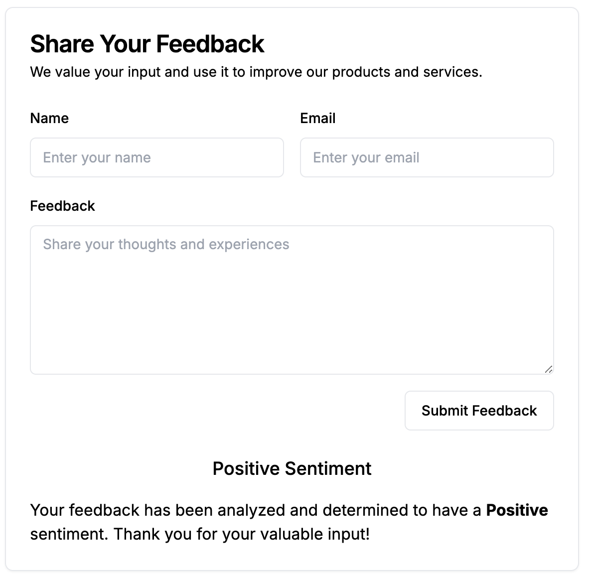

<div align="center">
  <h1>Feedback Sentiment Analyzer</h1>
</div>

Deployed Project Link: [https://feedback-sentiment-analyzer.vercel.app/](https://feedback-sentiment-analyzer.vercel.app/)

App built using Next.js that allows you to receive user input/feedback, analyze that user input/feedback, and determine a sentiment score (positive, negative, or neutral).

# Table of Contents

- [DevOps/Continous Integration](#devops)
- [Screenshots](#screenshots)
- [Acknowledgments](#about-the-project)
- [About the Project](#about-the-project)
  - [Built With](#tech-stack)
  - [Server Actions](#sever-actions)
- [Getting Started](#getting-started)
- [Running Unit Tests](#running-tests-locally)
- [Running e2e Automation Tests](#running-tests-e2e)
- [Deployment](#deployment)

## <a name="devops"></a>Devops/Continuous Integration

For this projects, unit/component tests and e2e tests have been set up to run in a Continuous Integration (CI) environment using GitHub actions. These actions are in the `.github/actions` directory of this repository. This means that when code is pushed to the main branch, 2 GitHub actions will be kicked off. One action is to run the Jest tests in CI. The other action is to run the Playwright (e2e) tests in CI. If either of those fail, you will receive an email notification regarding the failed tests.

## <a name="screenshots"></a>Screenshots



## <a name="acknowledgments"></a>Acknowledgments

- [Next.js](https://nextjs.org/) for the robust and flexible React framework.

## <a name="about-the-project"></a>About the Project

### <a name="tech-stack"></a>Built With

  <ul>
      <li><a href="https://nextjs.org/"">Next.js</a></li>
    <li><a href="https://www.typescriptlang.org/">Typescript</a></li>
    <li><a href="https://react.dev/">React.js</a></li>
    <li><a href="https://jestjs.io/">Jest (unit testing)</a></li>
    <li><a href="https://playwright.dev/">Playwright (e2e testing)</a></li>
    <li><a href="https://testing-library.com/docs/react-testing-library/intro/">React Testing Library (component testing)</a></li>
    <li><a href="https://tailwindcss.com/">Tailwind</a></li>
  </ul>

### <a name="server-actions"></a>Server Actions

The form for submitting the user input/feedback takes advantage of Next.js Server Actions.

Server Components in React allow functions to execute on the server, reducing the client side load. Next.js leverages this feature through Server Actions, which connect forms directly to server-side functions. This eliminates the need for client-side state management typically associated with forms, like using useState. The server action connected to the form in this project can be found in the `app/actions` direectory of this repository. By using a server action, data handling is drastically simplified. For more information, see <https://nextjs.org/docs/app/building-your-application/data-fetching/server-actions-and-mutations>.

## <a name="getting-started"></a>Getting Started

Follow these instructions to set up and run the project on your local machine.

Clone the project from GitHub.

```bash
  git clone https://github.com/philipstubbs13/feedback-sentiment-analyzer
```

Go to the project directory.

```bash
  cd feedback-sentiment-analyzer
```

Install dependencies.

```bash
  npm install
```

Start the Next.js development server.

```bash
  npm run dev
```

Open [http://localhost:3000](http://localhost:3000) with your browser to see the result.

You can start editing the page by modifying `app/page.tsx`. The page auto-updates as you edit the file.

This project uses [`next/font`](https://nextjs.org/docs/basic-features/font-optimization) to automatically optimize and load Inter, a custom Google Font.

To learn more about Next.js, take a look at the following resources:

- [Next.js Documentation](https://nextjs.org/docs) - learn about Next.js features and API.
- [Learn Next.js](https://nextjs.org/learn) - an interactive Next.js tutorial.

## <a name="running-tests-locally"></a>Running Unit Tests

For writing and running unit tests for application logic, this project is set up to use [Jest](https://jestjs.io/). For writing and running component tests for React components, this project is set up to use [React Testing Library](https://testing-library.com/docs/react-testing-library/intro/).

For more information on testing in a Next.js application, see <https://nextjs.org/docs/app/building-your-application/testing>

To run both unit tests and component tests within this project, run the following command in the root directory.

```bash
  npm run test
```

To generate a test coverage report, run the following command:

```
npm run coverage
```

Note that these tests are also set up to run automatically in a CI environment when code is pushed to the main branch.

## <a name="running-tests-e2e"></a>Running e2e Automation Tests

For writing and running e2e automation tests, this project is set up to use [Playwright](https://playwright.dev/). You can find these tests in the `tests` directory of this repository.

To run e2e tests, run the following command in the root directory.

```bash
npm run test:e2e
```

To run e2e tests in UI mode, run the following command in the root directory.

```bash
npm run test:e2e:ui
```

Note that these tests are also set up to run automatically in a CI environment when code is pushed to the main branch.

## <a name="deployment"></a>Deployment

This app is deployed through the [Vercel Platform](https://vercel.com/new?utm_medium=default-template&filter=next.js&utm_source=create-next-app&utm_campaign=create-next-app-readme).
Deploys are set up to happen automatically when code is merged into the `main` branch.
